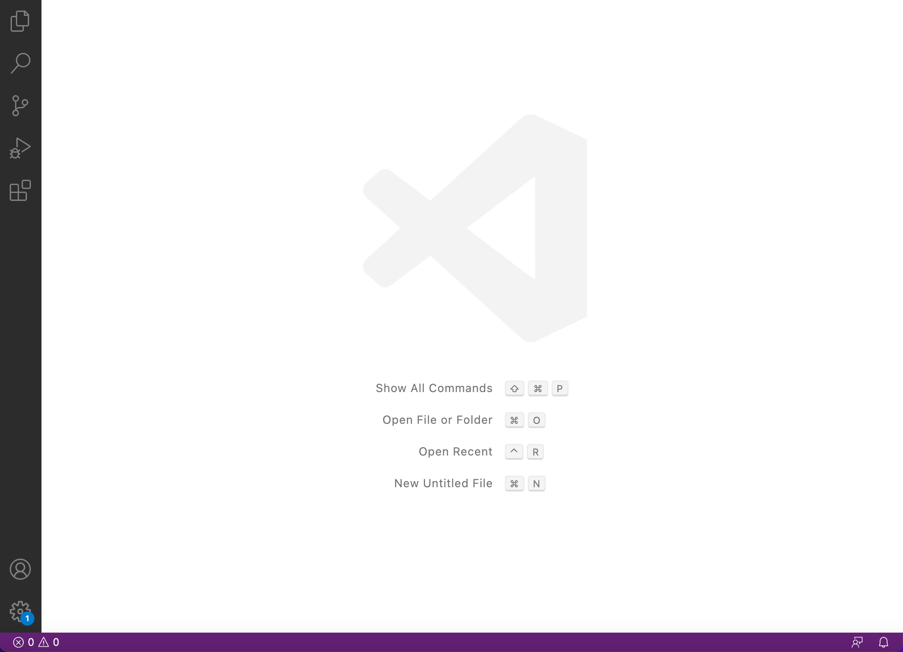
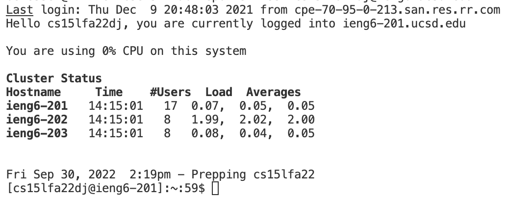
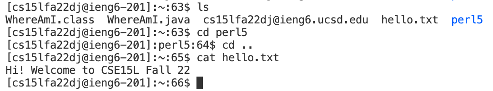
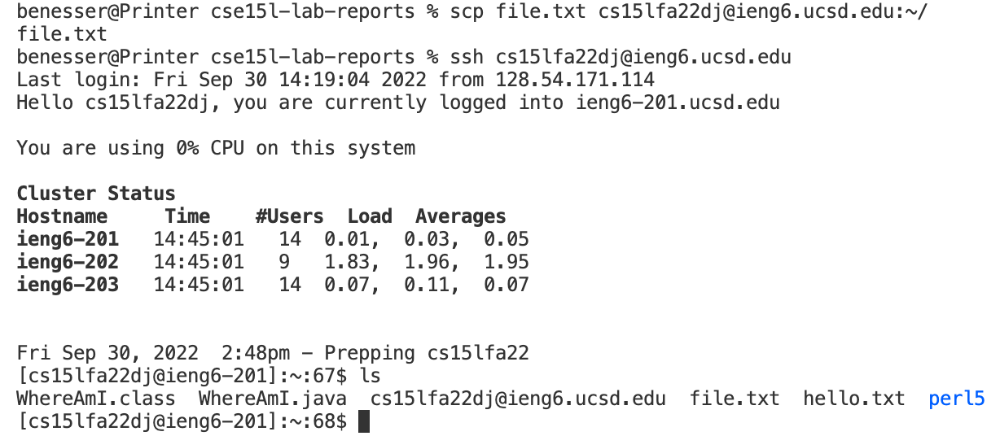
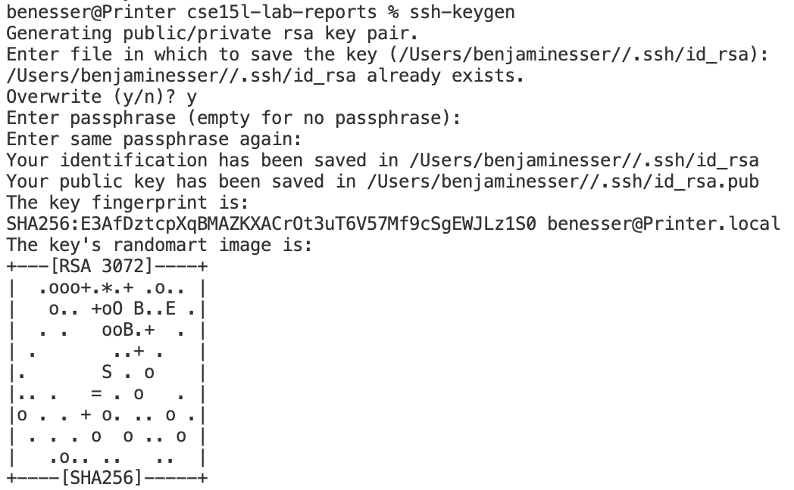
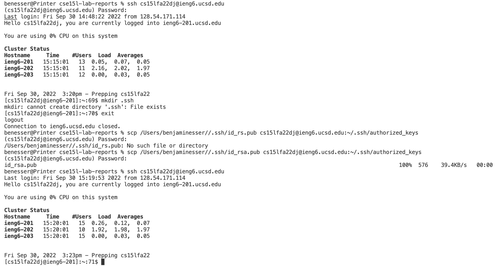
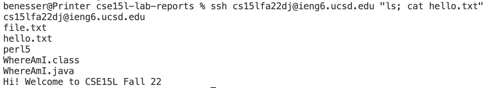

# Remote Access Tutorial
1. Go to https://code.visualstudio.com/ and follow the instructions to download it onto your computer. Now open your newly installed VScode, click away the welcome page, and your screen should look something like this:  

2. Click "terminal">"new terminal" and enter "ssh cs15lfa22dj@ieng6.ucsd.edu" into the terminal where the last 2 letters before the @ are unique to your account (they might not be "dj"). If your computer questions the authenticity of the host and asks if you would like to continue connecting, type "yes". Next enter your password. The terminal should give you this output:  meaning you have connected remotely to the server.

3. Now you can type some commands. Try "ls" to see a list of the files in the directory you are in, "cd <folder_name>" to navigate to a new folder, "cd .." to navigate up a directory, or "cat <file_name>" to print the contents of a file. Here are all of those commands in action:  There are lots of others.

4. We can move files from our local computer to the server using "scp". First type exit into the terminal to log out of the server and get back into your local directory. Now make any file in this directory and type "scp <file_name> cs15lfa22dj@ieng6.ucsd.edu:~/" to copy the file onto the server. You can check that it worked by "ssh"ing back into the server and typing "ls". Here is an example: 

5. We can use ssh keys to remove having to enter your password everytime you interact with the server. Type "exit" to make sure you are in your local directory. Now type "ssh-keygen" and enter when it prompts you for a file to save the key (this should save it in the default directory). Also type enter without entering a passphrase to give yourself no password. This should save your key at some address like "/Users/benjaminesser//.ssh/id_rsa.pub". For example:  Now ssh back into the server and type "mkdir .ssh" to make a new directory for this key. Then type "exit" to go back to your local directory and type "scp /Users/benjaminesser//.ssh/id_rsa.pub cs15lfa22dj@ieng6.ucsd.edu:~/.ssh/authorized_keys" to copy the key into this newly created directory (where "/Users/benjaminesser//.ssh/id_rsa.pub" should be the path to your key created earlier in this step). Now ssh back into the server and you should not have to enter a password. Here is an exmaple of it working: 

6. To speed up your time accessing the server remotely you can use the up arrow key to access your most recent terminal command. You can also use quotes and semicolons after your ssh command to run multiple terminal commands at once and save time. For example: 
